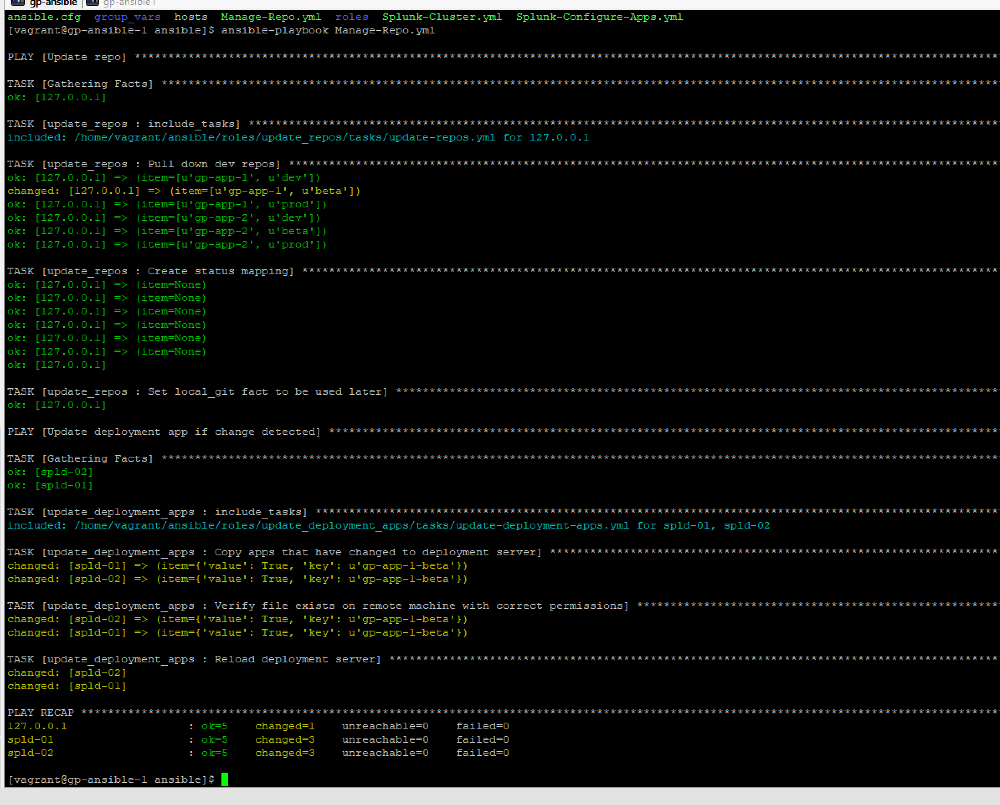
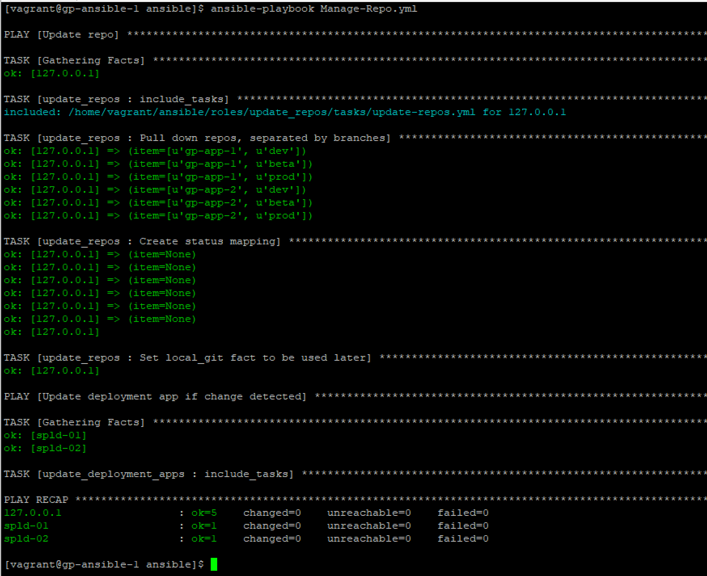
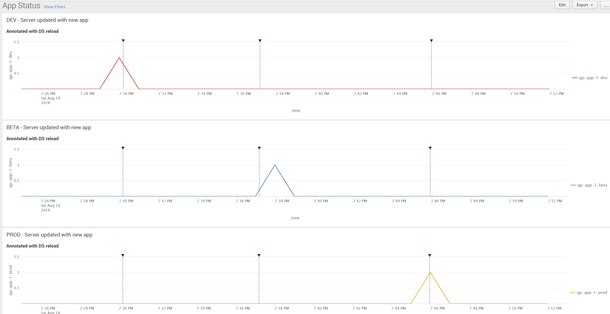

Ansible Roles/Plays to automate pulling from a git repo, and updating deployment server with apps whose branches have changed.

## Change in repo leads to pull down locally, triggering app push to deployment server(s)

## Rerun shows all green, no changes, push to DS doesn't happen

## Dashboard utilizing internal and audit data to track app deployments to clients

### Improvements on initial request

1. Not just one repo is maintained, but multiple with the same structure.  They can be pulled in to automation by just adding repo name to list variable.

2. Added dashboard to view app deployment status

### Ways to improve on current design

1. Current version considers all deployment servers equal.  Every DS will receive every branch of every app.  With multiple clients, it's possible not all will receive every app.  Client inventories should be created, and all DSs that receive a group of apps should be joined via group:children hierarchy in inventory.  Each group would maintain its own repos/branches lists.

2. A scheduler such as the one built into Ansible Tower / AWX should be used to maintain deployments.  It's possible you wouldn't want to deploy certain apps immediately should they affect a client's access to Splunk.  

3. Dynamic inventory should be utilized if possible.  Inventory maintenance is the most challenging piece of this and should not be done manually by Ansible developers.  If using AWS or some CMDB, ansible should dynamically pull the latest servers in need of apps from the centrally managed solution.